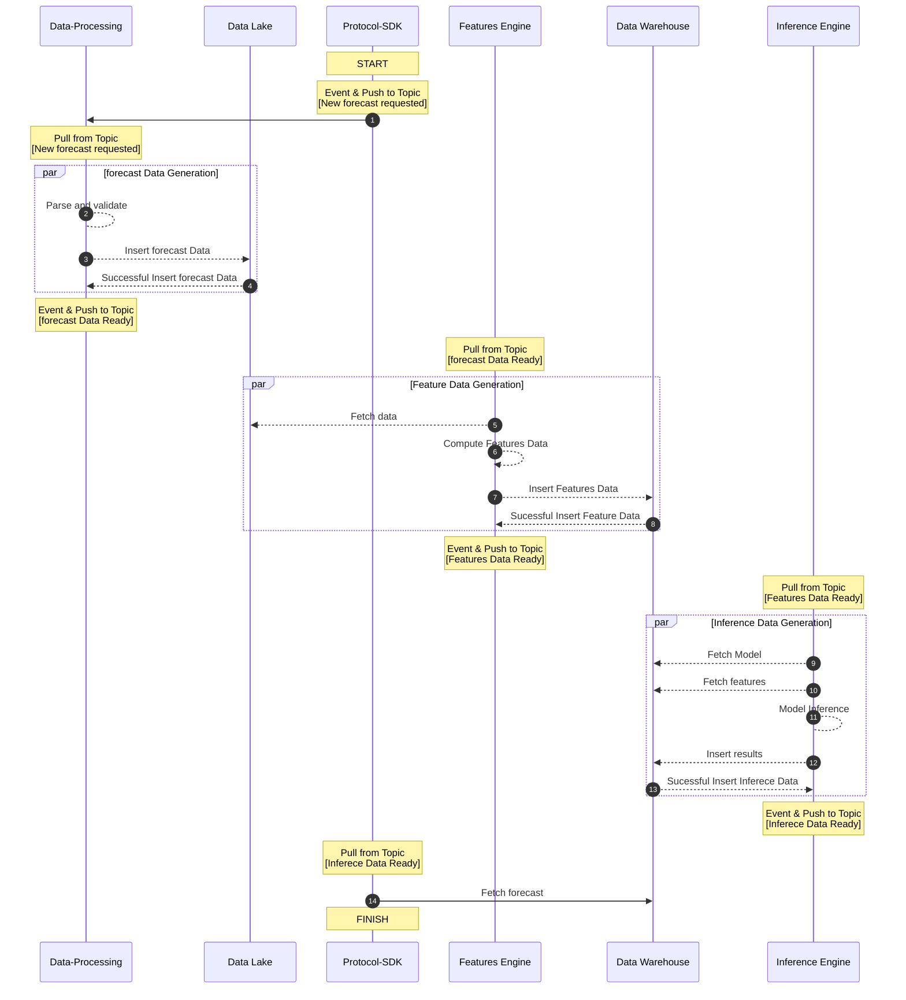

# CL-AMM
Concentrated Liquidity Automated Market Making (Project for Quant Dev)

### Adverse Selection & Price-Range-Volume Chaser Model (mermaid)

```mermaid
sequenceDiagram
autonumber

participant Data-processing as Data-Processing
participant DL as Data Lake
participant Report-API as Protocol-SDK
participant FE as Features Engine
participant DW as Data Warehouse
participant IE as Inference Engine

Note over Report-API : START
Note over Report-API : Event & Push to Topic <br/> [New forecast requested]
Report-API ->> Data-processing : 
Note over Data-processing: Pull from Topic <br/> [New forecast requested]

par forecast Data Generation
	Data-processing --> Data-processing: Parse and validate
	Data-processing -->> DL: Insert forecast Data
	DL -->> Data-processing: Successful Insert forecast Data
end

Note over Data-processing: Event & Push to Topic <br/> [forecast Data Ready]

Note over FE: Pull from Topic <br/> [forecast Data Ready]
par Feature Data Generation
	FE -->> DL: Fetch data
	FE -->> FE: Compute Features Data
	FE -->> DW: Insert Features Data
	DW -->> FE: Sucessful Insert Feature Data
end
Note over FE: Event & Push to Topic <br/> [Features Data Ready]

Note over IE: Pull from Topic <br/> [Features Data Ready]
par Inference Data Generation
	IE -->> DW: Fetch Model
	IE -->> DW: Fetch features
	IE --> IE: Model Inference
	IE -->> DW: Insert results
	DW -->> IE: Sucessful Insert Inferece Data
end
Note over IE: Event & Push to Topic <br/> [Inferece Data Ready]

Note over Report-API: Pull from Topic <br/> [Inferece Data Ready]
Report-API ->> DW: Fetch forecast
Note over Report-API : FINISH
```
